# Design Document: KeGo Full Persistence

## Overview

KeGo is a project memory and recovery tool. Currently all data is served from an in-memory mock (`src/lib/mock-data.ts`) and several UI features are frontend shells with no real backend. This design covers replacing every mock with real Supabase reads/writes, completing each shell feature to production quality, and providing the supporting infrastructure (schema, typed client, service modules, seed data, error handling).

The persistence layer follows a **service module pattern**: each feature area gets a dedicated `src/lib/services/` module that encapsulates all Supabase calls. Page/component files import from these service modules; they never call `supabase.from()` directly. This keeps query logic testable and separate from rendering.

The **fallback contract** is consistent across the entire app: if `getClient()` returns `null` (env vars missing), every service function returns the corresponding mock-data value instead of throwing. A `DemoModeBanner` component surfaces this state to the user.

### Tech Stack Alignment

The app already uses:
- React 18 + TypeScript + Vite
- `@tanstack/react-query` for async state
- `wouter` for routing
- `sonner` for toasts
- The existing `src/lib/supabase/client.ts` has a working async lazy-init pattern

The design extends these existing patterns rather than introducing new dependencies.

---

## Architecture

```mermaid
graph TD
    subgraph UI["UI Layer (Pages + Components)"]
        Dashboard
        Projects
        ProjectHub
        ProjectRecovery
        ProjectVault
        ProjectTimeline
        Settings
        Search
        Integrations
    end

    subgraph Services["Service Layer (src/lib/services/)"]
        projectsService["projects.ts"]
        memoryService["memory.ts"]
        recoveryService["recovery.ts"]
        searchService["search.ts"]
        integrationsService["integrations.ts"]
        settingsService["settings.ts"]
        hubService["hub.ts"]
    end

    subgraph Client["Supabase Client (src/lib/supabase/)"]
        getClient["getClient() — typed singleton"]
        rowTypes["Row types (database.types.ts)"]
    end

    subgraph DB["Supabase PostgreSQL"]
        projects_tbl["projects"]
        decisions_tbl["decisions"]
        milestones_tbl["milestones"]
        vault_entries_tbl["vault_entries"]
        timeline_events_tbl["timeline_events"]
        checkins_tbl["checkins"]
        recovery_workspaces_tbl["recovery_workspaces"]
        integrations_tbl["integrations"]
        user_settings_tbl["user_settings"]
    end

    UI --> Services
    Services --> Client
    Client --> DB
```



### Request Flow

For every data-driven component the flow is:

1. Page mounts → React Query `useQuery` calls a service function
2. Service function calls `getClient()` → if `null`, returns mock data
3. If client exists, executes typed Supabase query
4. On error, service throws; React Query exposes `error`; component renders error UI and shows a toast
5. On success, data is cached by React Query with a 60-second stale time

Mutations (insert/update/delete) use `useMutation`:
1. Mutation fires → service function runs upsert/delete
2. On success, `queryClient.invalidateQueries` triggers a background refetch
3. On failure, toast with error message; optimistic update is rolled back

---

## Components and Interfaces

### src/lib/supabase/client.ts — Upgraded

The existing file is extended to export `getClient()` (synchronous after first load) and a full `Database` type.

```typescript
// Exported function signature
export function getClient(): SupabaseClient<Database> | null

// Re-exported for convenience
export type { Database }
export type ProjectRow = Database['public']['Tables']['projects']['Row']
export type DecisionRow = Database['public']['Tables']['decisions']['Row']
export type MilestoneRow = Database['public']['Tables']['milestones']['Row']
export type VaultEntryRow = Database['public']['Tables']['vault_entries']['Row']
export type TimelineEventRow = Database['public']['Tables']['timeline_events']['Row']
export type CheckinRow = Database['public']['Tables']['checkins']['Row']
export type RecoveryWorkspaceRow = Database['public']['Tables']['recovery_workspaces']['Row']
export type IntegrationRow = Database['public']['Tables']['integrations']['Row']
export type UserSettingsRow = Database['public']['Tables']['user_settings']['Row']
```

The singleton pattern stays as-is (module-level `_client` variable). The `createClient` async export is kept for backward compatibility with `useHeartbeatData` and `useSedimentData` which already use it.

### src/lib/services/projects.ts

```typescript
export async function fetchProjects(): Promise<Project[]>
export async function createProject(name: string, description?: string): Promise<Project>
export async function updateProject(id: string, patch: Partial<ProjectRow>): Promise<void>
export async function deleteProject(id: string): Promise<void>
export async function markProject(id: string): Promise<void>      // sets paused_at, health
export async function resumeProject(id: string): Promise<void>    // sets resumed_at, health
```

### src/lib/services/memory.ts

```typescript
export async function fetchVaultEntries(projectId: string): Promise<VaultEntry[]>
export async function createVaultEntry(entry: Omit<VaultEntryRow, 'id' | 'created_at' | 'updated_at'>): Promise<VaultEntry>
export async function updateVaultEntry(id: string, patch: Partial<VaultEntryRow>): Promise<void>
export async function deleteVaultEntry(id: string): Promise<void>
export async function fetchDecisions(projectId: string): Promise<Decision[]>
export async function createDecision(decision: Omit<DecisionRow, 'id' | 'created_at'>): Promise<Decision>
export async function fetchMilestones(projectId: string): Promise<Milestone[]>
export async function updateMilestone(id: string, patch: Partial<MilestoneRow>): Promise<void>
export async function fetchTimelineEvents(projectId: string): Promise<TimelineEvent[]>
export async function createTimelineEvent(event: Omit<TimelineEventRow, 'id' | 'created_at'>): Promise<TimelineEvent>
```

### src/lib/services/recovery.ts

```typescript
export async function fetchRecoveryWorkspace(projectId: string): Promise<RecoveryWorkspace>
export async function upsertRecoveryWorkspace(workspace: Partial<RecoveryWorkspaceRow> & { project_id: string }): Promise<void>
```

### src/lib/services/hub.ts

```typescript
export interface HubData {
  momentumScore: number
  streak: number
  inboxItems: InboxItem[]
  snapshots: Snapshot[]
}
export async function fetchHubData(projectId: string): Promise<HubData>
export function computeMomentumScore(checkins: CheckinRow[]): number
export function computeStreak(checkins: CheckinRow[]): number
```

### src/lib/services/search.ts

```typescript
export interface SearchResult {
  id: string; title: string; content: string
  type: 'decision' | 'note' | 'resource' | 'milestone' | 'project'
  project: string; date: string; relevance: number; projectId: string
}
export async function universalSearch(query: string): Promise<SearchResult[]>
export async function fetchGraphNodes(): Promise<{ nodes: GraphNode[]; edges: GraphEdge[] }>
```

### src/lib/services/integrations.ts

```typescript
export async function fetchIntegration(projectId: string, provider: string): Promise<IntegrationRow | null>
export async function connectIntegration(projectId: string, provider: string, repoUrl: string, settings: object): Promise<IntegrationRow>
export async function disconnectIntegration(id: string): Promise<void>
export async function syncGitHub(integration: IntegrationRow): Promise<void>
```

### src/lib/services/settings.ts

```typescript
export async function fetchSettings(userId: string): Promise<UserSettingsRow | null>
export async function upsertSettings(patch: Partial<UserSettingsRow> & { user_id: string }): Promise<void>
```

### src/hooks/useDemoMode.ts

```typescript
export function useDemoMode(): boolean
// Returns true when VITE_SUPABASE_URL or VITE_SUPABASE_ANON_KEY is missing
```

### src/components/layout/DemoModeBanner.tsx

Renders a dismissible sticky banner at the top of the app when `useDemoMode()` is true.

---

## Data Models

### Database Schema

Full migration at `supabase/migrations/001_initial_schema.sql`.

#### projects

| Column | Type | Constraints |
|---|---|---|
| id | uuid | PK default gen_random_uuid() |
| user_id | uuid | FK → auth.users, not null |
| name | text | not null |
| description | text | |
| health | text | default 'active' |
| resume_score | integer | default 0 |
| recovery_confidence | integer | default 0 |
| context_completeness | integer | default 0 |
| tags | text[] | default '{}' |
| last_activity | timestamptz | default now() |
| paused_at | timestamptz | |
| resumed_at | timestamptz | |
| created_at | timestamptz | default now() |

#### decisions

| Column | Type | Constraints |
|---|---|---|
| id | uuid | PK default gen_random_uuid() |
| project_id | uuid | FK → projects, not null |
| title | text | not null |
| description | text | |
| rationale | text | |
| alternatives | text[] | default '{}' |
| consequences | text | |
| confidence | integer | default 50 |
| decided_at | timestamptz | default now() |
| created_at | timestamptz | default now() |

#### milestones

| Column | Type | Constraints |
|---|---|---|
| id | uuid | PK default gen_random_uuid() |
| project_id | uuid | FK → projects, not null |
| title | text | not null |
| description | text | |
| status | text | default 'planned' |
| percent_complete | integer | default 0 |
| due_date | timestamptz | |
| completed_at | timestamptz | |
| created_at | timestamptz | default now() |

#### vault_entries

| Column | Type | Constraints |
|---|---|---|
| id | uuid | PK default gen_random_uuid() |
| project_id | uuid | FK → projects, not null |
| title | text | not null |
| content | text | |
| category | text | default 'note' |
| tags | text[] | default '{}' |
| created_at | timestamptz | default now() |
| updated_at | timestamptz | default now() |

#### timeline_events

| Column | Type | Constraints |
|---|---|---|
| id | uuid | PK default gen_random_uuid() |
| project_id | uuid | FK → projects, not null |
| type | text | not null |
| title | text | not null |
| description | text | |
| timestamp | timestamptz | default now() |
| created_at | timestamptz | default now() |

#### checkins

| Column | Type | Constraints |
|---|---|---|
| id | uuid | PK default gen_random_uuid() |
| project_id | uuid | FK → projects, not null |
| checkin_date | date | not null, default current_date |
| ai_summary | text | |
| created_at | timestamptz | default now() |

#### recovery_workspaces

| Column | Type | Constraints |
|---|---|---|
| id | uuid | PK default gen_random_uuid() |
| project_id | uuid | FK → projects, unique, not null |
| project_summary | text | |
| completed_work | text | |
| pending_work | text | |
| blockers | text | |
| important_decisions | text | |
| important_resources | text | |
| suggested_next_action | text | |
| estimated_time_to_resume | text | |
| last_updated | timestamptz | default now() |

#### integrations

| Column | Type | Constraints |
|---|---|---|
| id | uuid | PK default gen_random_uuid() |
| project_id | uuid | FK → projects, not null |
| provider | text | not null |
| repo_url | text | |
| settings | jsonb | default '{}' |
| connected_at | timestamptz | default now() |
| last_sync_at | timestamptz | |

#### user_settings

| Column | Type | Constraints |
|---|---|---|
| user_id | uuid | PK FK → auth.users |
| display_name | text | |
| email | text | |
| appearance | text | default 'system' |
| notifications | jsonb | default '{}' |
| updated_at | timestamptz | default now() |

#### project_memory (view)

A convenience view combining decisions, milestones, vault_entries into a single `project_memory` shape with `id`, `project_id`, `memory_type`, `content`, `created_at`. Used by `useSedimentData` and other components that need a unified memory stream.

```sql
CREATE VIEW project_memory AS
  SELECT id, project_id, 'decision' AS memory_type, title AS content, created_at FROM decisions
  UNION ALL
  SELECT id, project_id, 'milestone' AS memory_type, title AS content, created_at FROM milestones
  UNION ALL
  SELECT id, project_id, category AS memory_type, content, created_at FROM vault_entries;
```

#### tasks (optional, referenced by heartbeat)

The `useHeartbeatData` hook already queries a `tasks` table. The initial migration includes a minimal definition:

| Column | Type |
|---|---|
| id | uuid PK |
| project_id | uuid FK → projects |
| title | text |
| status | text |
| completed_at | timestamptz |
| created_at | timestamptz default now() |

### TypeScript Domain Types (src/lib/types.ts additions)

`Project`, `Decision`, `Milestone`, `VaultEntry`, `TimelineEvent`, `RecoveryWorkspace` already exist. New additions:

```typescript
export interface InboxItem {
  id: string
  title: string
  description: string
  priority: 'high' | 'medium' | 'low'
  createdAt: Date
  sourceType: 'vault_entry' | 'timeline_event'
}

export interface Snapshot {
  id: string
  date: Date
  status: string
  progress: number
}

export interface GraphNode {
  id: string
  label: string
  type: 'decision' | 'note' | 'resource' | 'milestone' | 'project'
  projectId: string
  projectName: string
  tags: string[]
  relevance: number
}

export interface GraphEdge {
  source: string
  target: string
  reason: 'shared-tag' | 'linked-milestone' | 'linked-decision'
}
```

### Row-to-Domain Mapping

Each service module contains a `rowToProject(row: ProjectRow): Project` style mapper. These are pure functions and are the primary target for property-based tests.

```typescript
// Example mapper shapes
function rowToProject(row: ProjectRow): Project
function rowToDecision(row: DecisionRow): Decision
function rowToVaultEntry(row: VaultEntryRow): VaultEntry
function rowToTimelineEvent(row: TimelineEventRow): TimelineEvent
```

---

## Correctness Properties

*A property is a characteristic or behavior that should hold true across all valid executions of a system — essentially, a formal statement about what the system should do. Properties serve as the bridge between human-readable specifications and machine-verifiable correctness guarantees.*

Property-based testing is appropriate here because the core persistence layer consists of pure mapper functions and pure computation functions (sort, filter, score calculation, streak calculation, search filtering) that operate over varied inputs. These functions are independent of Supabase infrastructure and can be tested exhaustively with generated data.

The recommended PBT library is **fast-check** (TypeScript-native, excellent ecosystem).

### Property 1: Client Singleton Identity

*For any* number of consecutive calls to `getClient()` within the same module instance, all calls SHALL return the same object reference (or all return null if env vars are absent).

**Validates: Requirements 2.3**

### Property 2: Projects Sorted by Last Activity Descending

*For any* array of projects with arbitrary `last_activity` timestamps, the result of `fetchProjects()` (or its underlying sort function) SHALL be ordered such that `projects[i].lastActivity >= projects[i+1].lastActivity` for all valid indices.

**Validates: Requirements 3.1**

### Property 3: Mark/Resume State Machine Round-Trip

*For any* project with initial health in `['healthy', 'active']`, calling `markProject()` SHALL produce health `'at-risk'` and a non-null `paused_at`. Subsequently calling `resumeProject()` on that same project SHALL produce health `'recovering'` and a non-null `resumed_at` that is after `paused_at`.

**Validates: Requirements 6.2, 6.4**

### Property 4: Sediment Memories Cover Input Data

*For any* non-empty array of decisions, milestones, and vault entries for a project, every item in the input SHALL be represented by at least one entry in the output of the sediment memory builder, unless the total count exceeds the display cap of 12 (in which case only the 12 most recent items are required to appear).

**Validates: Requirements 7.1, 7.2**

### Property 5: Heartbeat Row-to-RingEvent Type Mapping

*For any* checkin row, the produced `RingEvent` SHALL have `type = 'checkin'` and a `date` equal to the row's `checkin_date`. *For any* decision row, the produced `RingEvent` SHALL have `type = 'decision'` and a `date` equal to the row's `decided_at`. The mapping SHALL preserve the temporal ordering of source rows.

**Validates: Requirements 8.1, 8.2**

### Property 6: Momentum Score Is Bounded and Recency-Weighted

*For any* array of checkin rows spanning the last 7 days, `computeMomentumScore()` SHALL return a value in `[0, 100]`. For two sets of checkins with equal count but where set A has more recent timestamps than set B, set A SHALL yield a score greater than or equal to set B's score.

**Validates: Requirements 9.1**

### Property 7: Streak Equals Maximum Consecutive Checkin Days

*For any* array of checkin rows containing a known run of N consecutive calendar days ending at the most recent date, `computeStreak()` SHALL return N.

**Validates: Requirements 9.2**

### Property 8: Universal Search Returns Only Matching Results

*For any* non-empty search query string Q and any dataset, every result returned by `universalSearch(Q)` SHALL contain Q (case-insensitively) in at least one of its searchable fields (`title` or `content`). No result SHALL be returned that does not match Q.

**Validates: Requirements 11.1**

### Property 9: Search Results Are Grouped by Type

*For any* array of search results with mixed types, the grouping function SHALL produce exactly one group per distinct type present in the input, and each group SHALL contain only results of that type.

**Validates: Requirements 11.2**

### Property 10: Empty Search Returns Entries Sorted by Date Descending

*For any* dataset queried with an empty string, the returned entries SHALL be sorted such that `results[i].date >= results[i+1].date` for all valid indices.

**Validates: Requirements 11.3**

### Property 11: Graph Nodes Have 1:1 Mapping to Source Rows

*For any* combined set of decision rows, vault entry rows, and milestone rows, the output of `buildGraphNodes()` SHALL contain exactly one node per source row, with the node's `id` matching the source row's `id` and `type` matching the source row's table/category.

**Validates: Requirements 12.1**

### Property 12: Graph Edges Exist Exactly Where Tags Are Shared

*For any* two graph nodes A and B, an edge SHALL exist between them if and only if their `tags` arrays share at least one common tag. No spurious edges SHALL exist between nodes with disjoint tag sets.

**Validates: Requirements 12.2**

### Property 13: Dashboard Stats Accurately Reflect Project Health Distribution

*For any* array of projects with arbitrary health values, `computeDashboardStats()` SHALL return: (a) `total` equal to the array length; (b) `healthy` equal to the count of projects with health `'healthy'` or `'active'`; (c) `atRisk` equal to the count with health `'at-risk'`, `'stalled'`, or `'dormant'`; (d) `recommendations` containing only projects from the at-risk/stalled/dormant set, ordered by `last_activity` ascending.

**Validates: Requirements 15.1, 15.2, 15.3**

---

## Error Handling

### Fallback Mode

When `VITE_SUPABASE_URL` or `VITE_SUPABASE_ANON_KEY` is absent, `getClient()` returns `null`. Every service function checks for `null` at its entry point and returns the appropriate mock-data value:

```typescript
// Pattern used throughout all service modules
export async function fetchProjects(): Promise<Project[]> {
  const client = getClient()
  if (!client) return mockProjects   // fallback
  // ... real query
}
```

The `DemoModeBanner` component (rendered in `AppLayout`) calls `useDemoMode()` and renders a sticky top banner informing the user that data will not persist.

### Query Error Handling

All service functions let Supabase errors propagate as thrown `Error` instances. React Query catches these and exposes them through the `error` field. Components respond with:

1. Render a skeleton during `isLoading`
2. Render an error card with a Retry button on `isError`
3. Show a toast via `sonner`'s `toast.error()` on mutation failure

```typescript
// Standard error toast pattern
if (error) {
  toast.error(`Failed to load projects: ${error.message}`)
  console.error('[KeGo]', error)
}
```

### 404 / Not Found

If a project page is loaded with an ID that returns no row (empty array from Supabase), the page renders the existing "Project not found" card with a link back to `/projects`. This replaces the current mock-based `mockProjects.find()` check.

### Unhandled Errors

`src/main.tsx` will wrap `<App />` in a React `ErrorBoundary` (using a simple class component) that renders a "Something went wrong" screen with a page reload button, preventing white-screen crashes.

### Toast Pattern

All mutations use a consistent toast pattern:

```typescript
useMutation({
  mutationFn: createVaultEntry,
  onSuccess: () => toast.success('Entry saved'),
  onError: (err) => toast.error(err.message),
  onSettled: () => queryClient.invalidateQueries({ queryKey: ['vault', projectId] }),
})
```

---

## Testing Strategy

### Unit Tests (Vitest)

Unit tests target pure functions — mappers, computation functions, and pure business logic — using **example-based** and **property-based** approaches.

Target files:
- `src/lib/services/projects.ts` — `rowToProject` mapper, `sortByLastActivity`
- `src/lib/services/hub.ts` — `computeMomentumScore`, `computeStreak`
- `src/lib/services/search.ts` — `filterResults`, `groupByType`, `sortByDate`
- `src/lib/services/memory.ts` — `rowToVaultEntry`, `rowToDecision`, `buildSedimentMemories`
- `src/lib/services/search.ts` — `buildGraphNodes`, `deriveEdges`
- `src/lib/services/projects.ts` — `computeDashboardStats`, `deriveRecommendations`
- `src/lib/supabase/client.ts` — singleton behavior

**Property-based tests** use `fast-check` with minimum 100 runs per property:

```typescript
// Example: Property 7 — Streak calculation
import * as fc from 'fast-check'
import { computeStreak } from '@/lib/services/hub'

test('streak equals max consecutive checkin days', () => {
  fc.assert(
    fc.property(
      fc.integer({ min: 1, max: 30 }),
      (streakLength) => {
        const today = new Date()
        const checkins = Array.from({ length: streakLength }, (_, i) => {
          const d = new Date(today)
          d.setDate(d.getDate() - (streakLength - 1 - i))
          return { checkin_date: d.toISOString().split('T')[0] } as CheckinRow
        })
        expect(computeStreak(checkins)).toBe(streakLength)
      }
    ),
    { numRuns: 100 }
  )
})
// Feature: kego-full-persistence, Property 7: streak equals max consecutive checkin days
```

Each property test carries a comment `// Feature: kego-full-persistence, Property N: <text>` referencing the design property.

### Integration Tests

Integration tests run against a local Supabase instance (via `supabase start`) or a test project:

- CRUD flows for each table (projects, vault_entries, decisions, milestones)
- Recovery workspace upsert (idempotency — run twice, verify single row)
- GitHub sync: mock the GitHub API, verify `timeline_events` rows are created

Integration tests live in `src/__tests__/integration/` and are excluded from the default test run (use `--testPathPattern=integration` to include them).

### Component Tests

Component tests use React Testing Library (already available via Vitest's jsdom environment):

- `DashboardPage` renders mock projects in fallback mode
- `UniversalSearch` renders empty state on zero results
- `KnowledgeVault` opens add-entry modal and submits
- `GitHubConnector` shows validation error on malformed URL

### Snapshot Tests

The migration SQL file (`001_initial_schema.sql`) is snapshot-tested to prevent accidental schema drift.

### PBT Library Setup

```json
// package.json — add to devDependencies
"fast-check": "^3.22.0",
"vitest": "^2.0.0",
"@testing-library/react": "^16.0.0",
"@testing-library/user-event": "^14.0.0"
```

Tests run with: `npx vitest --run`
