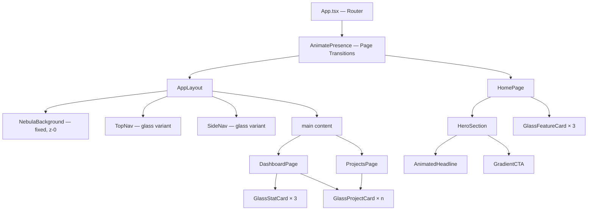
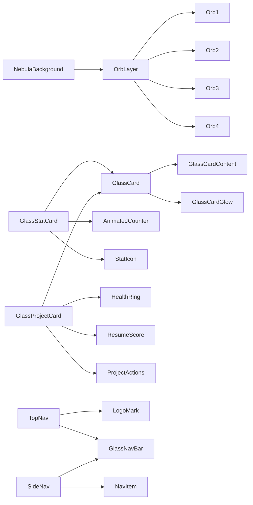
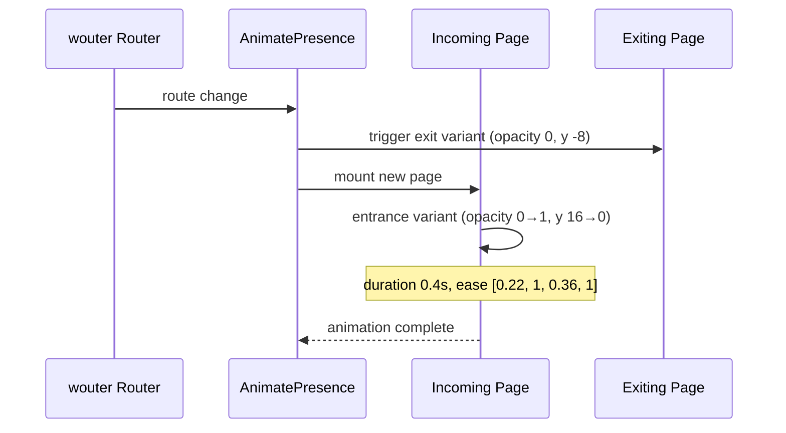
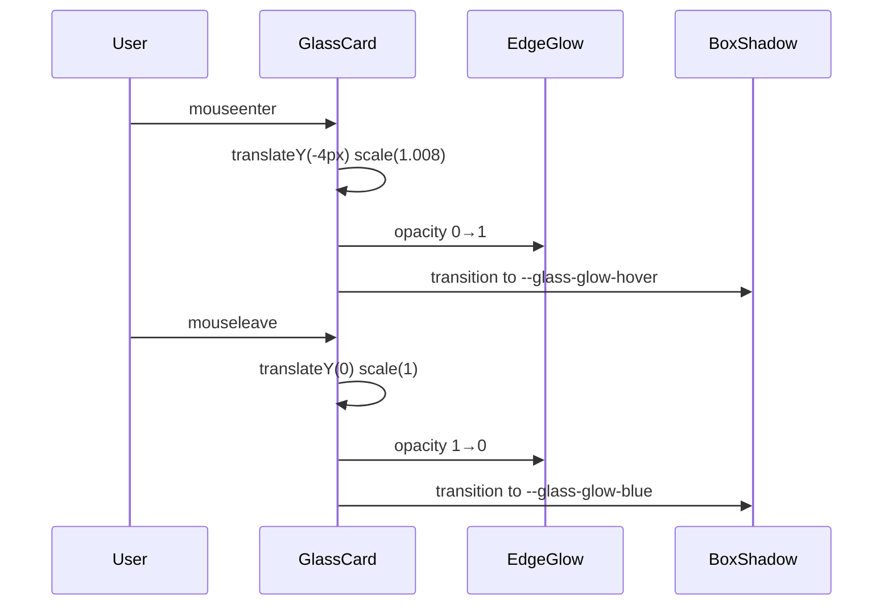

# Design Document: KeGo Premium UI

## Overview

A full-surface visual redesign of the KeGo app — transforming the current neutral light/dark theme into a premium Deep Space glassmorphism aesthetic. The design language centers on near-black navy/indigo backgrounds with floating frosted-glass panels, slow-drifting nebula orbs, and a deliberate animation system built on framer-motion. Every surface, interaction, and transition is intentional — editorial quality, not generated fluff.

The system is built entirely within the existing React + TypeScript + Vite + Tailwind v4 stack. No new dependencies beyond what is already installed (framer-motion is available). All new design tokens extend `index.css` via CSS custom properties. New components (`NebulaBackground`, `GlassCard`) are additive — existing shadcn/ui `Card` components are progressively replaced where they appear in layouts.

---

## Architecture



---

## Component Hierarchy



---

## Design Tokens — `index.css` Additions

All new tokens live under `.dark` and `:root` blocks, extending the existing CSS variable system.

### Deep Space Palette

```css
/* Deep Space Base */
--ds-base-0: #050810;          /* deepest background */
--ds-base-1: #0a0f1e;          /* primary background */
--ds-base-2: #0d1526;          /* elevated surface base */
--ds-base-3: #111d35;          /* card base before glass */

/* Blue-Violet Glow Spectrum */
--ds-glow-blue: #3b82f6;       /* electric blue */
--ds-glow-indigo: #6366f1;     /* blue-violet */
--ds-glow-violet: #8b5cf6;     /* violet accent */
--ds-glow-cyan: #06b6d4;       /* cool highlight */

/* Text Hierarchy */
--ds-text-primary: rgba(255, 255, 255, 0.95);
--ds-text-secondary: rgba(148, 163, 184, 0.9);   /* slate-400 */
--ds-text-muted: rgba(100, 116, 139, 0.7);        /* slate-500 */
--ds-text-glow: rgba(99, 102, 241, 0.9);          /* indigo glow text */
```

### Glassmorphism Tokens

```css
/* Glass Surface */
--glass-bg: rgba(13, 21, 38, 0.55);
--glass-bg-hover: rgba(17, 29, 53, 0.70);
--glass-border: rgba(255, 255, 255, 0.08);
--glass-border-hover: rgba(255, 255, 255, 0.16);
--glass-blur: blur(20px);
--glass-blur-heavy: blur(40px);
--glass-blur-nav: blur(24px);

/* Inner glow — applied as box-shadow */
--glass-glow-blue: 0 0 0 1px rgba(59, 130, 246, 0.12),
                   inset 0 1px 0 0 rgba(255, 255, 255, 0.06),
                   0 8px 32px rgba(59, 130, 246, 0.08);
--glass-glow-indigo: 0 0 0 1px rgba(99, 102, 241, 0.14),
                     inset 0 1px 0 0 rgba(255, 255, 255, 0.06),
                     0 8px 32px rgba(99, 102, 241, 0.10);
--glass-glow-hover: 0 0 0 1px rgba(99, 102, 241, 0.30),
                    inset 0 1px 0 0 rgba(255, 255, 255, 0.10),
                    0 16px 48px rgba(99, 102, 241, 0.18),
                    0 0 80px rgba(59, 130, 246, 0.06);

/* Glass Nav */
--glass-nav-bg: rgba(10, 15, 30, 0.72);
--glass-nav-border: rgba(255, 255, 255, 0.06);
```

### Nebula / Orb Tokens

```css
/* Nebula Orb Colors */
--orb-1: radial-gradient(circle, rgba(59, 130, 246, 0.35) 0%, transparent 70%);
--orb-2: radial-gradient(circle, rgba(99, 102, 241, 0.30) 0%, transparent 70%);
--orb-3: radial-gradient(circle, rgba(139, 92, 246, 0.25) 0%, transparent 70%);
--orb-4: radial-gradient(circle, rgba(6, 182, 212, 0.20) 0%, transparent 70%);

/* Orb Sizing */
--orb-size-lg: 700px;
--orb-size-md: 500px;
--orb-size-sm: 350px;
```

### Typography Tokens

```css
/* Display weights — Inter variable font */
--font-display: 'Inter', sans-serif;
--font-weight-display: 800;      /* hero headlines */
--font-weight-heading: 700;      /* section headers */
--font-weight-subheading: 600;   /* card titles */
--font-weight-body: 400;
--font-weight-label: 500;

/* Letter spacing */
--tracking-display: -0.04em;     /* tight for big headlines */
--tracking-heading: -0.02em;
--tracking-label: 0.06em;        /* uppercase labels */
--tracking-caps: 0.12em;         /* small caps badges */

/* Line heights */
--leading-display: 1.0;
--leading-heading: 1.2;
--leading-body: 1.65;
```

### Spacing Scale Additions

```css
/* Premium spacing — large breathing room */
--section-gap: 7rem;       /* between hero sections */
--content-gap: 2.5rem;     /* within content areas */
--card-pad: 1.75rem;       /* glass card padding */
--card-pad-sm: 1.25rem;
```

---

## Sequence Diagrams

### Page Transition Flow



### GlassCard Hover Interaction



---

## Components and Interfaces

### 1. NebulaBackground

**Purpose**: Fixed full-screen animated layer behind all content. Four blurred radial gradient orbs drift on independent sine/cosine paths using framer-motion `animate` with `repeat: Infinity`.

**File**: `src/components/ui/nebula-background.tsx`

**Interface**:

```typescript
interface OrbConfig {
  size: number            // px diameter
  color: string           // CSS gradient string
  initialX: string        // e.g. "15%"
  initialY: string        // e.g. "20%"
  xRange: [string, string, string]   // keyframe positions
  yRange: [string, string, string]
  duration: number        // seconds for one full cycle
  blur: number            // px blur radius
}

interface NebulaBackgroundProps {
  orbs?: OrbConfig[]      // override default 4 orbs
  className?: string
}
```

**Responsibilities**:
- Render 4 orbs via `motion.div` with `position: fixed`, `z-index: 0`, `pointer-events: none`
- Each orb animates `x` and `y` on offset durations (18s, 22s, 26s, 31s) with `ease: "easeInOut"` and `repeat: Infinity, repeatType: "reverse"`
- Apply `filter: blur(Npx)` per orb (80–140px) for soft nebula appearance
- Use `will-change: transform` for GPU compositing
- The component must not affect layout or intercept pointer events

---

### 2. GlassCard

**Purpose**: Replaces `Card` in key surfaces. Frosted-glass surface with backdrop-filter blur, subtle white border, inner glow, and hover lift animation.

**File**: `src/components/ui/glass-card.tsx`

**Interface**:

```typescript
type GlassVariant = 'default' | 'elevated' | 'nav' | 'hero'

interface GlassCardProps {
  variant?: GlassVariant
  glow?: 'blue' | 'indigo' | 'none'
  hover?: boolean          // enables lift+glow hover (default: true)
  className?: string
  children: React.ReactNode
  onClick?: () => void
}
```

**Variant specs**:

| Variant | Background | Blur | Border Opacity | Use Case |
|---------|-----------|------|----------------|----------|
| `default` | `--glass-bg` | 20px | 8% | Dashboard cards, project cards |
| `elevated` | `rgba(17,29,53,0.65)` | 28px | 12% | Stat cards, featured content |
| `nav` | `--glass-nav-bg` | 24px | 6% | Navigation bars |
| `hero` | `rgba(10,15,30,0.40)` | 40px | 10% | Hero section overlays |

---

### 3. TopNav (Glass variant)

**Purpose**: Sticky top navigation with glassmorphism surface. Logo upgrade with animated ring mark.

**File**: `src/components/layout/top-nav.tsx` (modified in-place)

**Interface** (no change to external API):

```typescript
// Same export: TopNav()
// Internal additions:
// - applies glass-nav-bg + backdrop-blur-nav
// - LogoMark: animated Orbit icon with pulse ring on mount
// - active route indicator: glowing bottom border on nav links
```

---

### 4. SideNav (Glass variant)

**Purpose**: Desktop sidebar with glass surface, active item glow, and animated active indicator pill.

**File**: `src/components/layout/side-nav.tsx` (modified in-place)

**Active item style change**:

```typescript
// FROM: bg-primary text-primary-foreground
// TO:   glass elevated surface + left border glow bar + text gradient
// Active pill: position: absolute, left: 0, w-0.5, h-full, bg gradient indigo→blue
```

---

### 5. GlassStatCard

**Purpose**: Dashboard stat card with animated counter, icon glow, and glass surface.

**File**: `src/components/ui/glass-stat-card.tsx`

**Interface**:

```typescript
interface GlassStatCardProps {
  label: string
  value: number
  icon: React.ComponentType<{ className?: string }>
  iconColor?: string          // tailwind color class
  trend?: 'up' | 'down' | 'neutral'
  loading?: boolean
  delay?: number              // stagger delay for entrance animation (seconds)
}
```

**AnimatedCounter sub-component**:

```typescript
interface AnimatedCounterProps {
  value: number
  duration?: number    // default 1.2s
}
// Uses framer-motion useMotionValue + useSpring + useTransform
// Counts up from 0 to value on mount
```

---

### 6. GlassProjectCard

**Purpose**: Replaces `ProjectCard` on Projects and Dashboard. Glass surface with HealthRing, animated hover lift, and edge glow.

**File**: `src/components/projects/glass-project-card.tsx`

**Interface**:

```typescript
interface GlassProjectCardProps {
  project: Project           // existing Project type unchanged
  variant?: 'compact' | 'full'
  onMark?: (id: string) => void
  onResume?: (id: string) => void
}
```

**HealthRing sub-component**:

```typescript
interface HealthRingProps {
  health: Project['health']    // 'healthy' | 'at-risk' | 'stalled' | 'dormant'
  size?: number                // default 40
  pulse?: boolean              // animated pulse ring for 'at-risk'
}
// SVG circle with stroke-dashoffset animation
// 'at-risk': animated pulsing outer ring (scale 1→1.4, opacity 1→0, repeat)
// 'healthy': static filled green ring
```

---

### 7. AnimatedHeadline

**Purpose**: Hero headline with word-by-word fade+slide-up entrance via framer-motion stagger.

**File**: `src/components/ui/animated-headline.tsx`

**Interface**:

```typescript
interface AnimatedHeadlineProps {
  text: string               // full headline string
  highlightWords?: string[]  // words to render with gradient treatment
  className?: string
  delay?: number             // initial delay before stagger starts
}
// Splits text by space, wraps each word in motion.span
// Stagger: 0.06s between words
// Word variant: { hidden: { opacity: 0, y: 20 }, visible: { opacity: 1, y: 0 } }
// Transition: spring, stiffness 300, damping 24
```

---

### 8. Page Transition Wrapper

**Purpose**: Wraps route-level components in AnimatePresence for smooth crossfade+slide transitions.

**File**: `src/App.tsx` (modified) + `src/components/ui/page-transition.tsx`

**Interface**:

```typescript
interface PageTransitionProps {
  children: React.ReactNode
  className?: string
}
// Wraps children in motion.div with pageVariants
// Used inside each page component's return, or via a HOC applied at Route level
```

**Variants**:

```typescript
const pageVariants = {
  initial: { opacity: 0, y: 12 },
  enter:   { opacity: 1, y: 0,  transition: { duration: 0.38, ease: [0.22, 1, 0.36, 1] } },
  exit:    { opacity: 0, y: -8, transition: { duration: 0.22, ease: [0.4, 0, 1, 1] } },
}
```

---

## Data Models

No new data models are introduced. All components consume existing `Project` type from `@/lib/types`. New CSS tokens and component props are purely presentational.

```typescript
// Existing — no changes
type ProjectHealth = 'healthy' | 'at-risk' | 'stalled' | 'dormant'

interface Project {
  id: string
  name: string
  description: string
  health: ProjectHealth
  resumeScore: number      // 0–100
  pausedAt?: Date
  lastActivity: Date
  tags: string[]
}
```

---

## Algorithmic Pseudocode

### Nebula Orb Animation Loop

```pascal
PROCEDURE renderNebulaOrbs()
  INPUT: orbs[] of OrbConfig
  OUTPUT: animated DOM elements

  FOR EACH orb IN orbs DO
    SEQUENCE
      element ← createMotionDiv(orb)

      animateX ← keyframes(orb.xRange, duration: orb.duration,
                            ease: "easeInOut", repeat: Infinity, repeatType: "reverse")
      animateY ← keyframes(orb.yRange, duration: orb.duration * 1.15,
                            ease: "easeInOut", repeat: Infinity, repeatType: "reverse")

      applyStyles(element, {
        position: "fixed",
        width: orb.size,
        height: orb.size,
        background: orb.color,
        filter: blur(orb.blur),
        willChange: "transform",
        pointerEvents: "none"
      })

      mountAnimated(element, { x: animateX, y: animateY })
    END SEQUENCE
  END FOR
END PROCEDURE
```

### AnimatedCounter

```pascal
PROCEDURE animateCounter(targetValue, duration)
  INPUT: targetValue: number, duration: number (seconds)
  OUTPUT: live-updating display value

  motionValue ← useMotionValue(0)
  springValue ← useSpring(motionValue, { stiffness: 100, damping: 30, restDelta: 0.001 })
  displayValue ← useTransform(springValue, v → Math.round(v))

  ON_MOUNT DO
    animate(motionValue, targetValue, { duration: duration })
  END ON_MOUNT

  RETURN displayValue
END PROCEDURE
```

### Page Transition Logic

```pascal
PROCEDURE handleRouteChange(prevRoute, nextRoute)
  INPUT: prevRoute: string, nextRoute: string
  OUTPUT: animated transition

  SEQUENCE
    AnimatePresence detects key change (route path)

    IF prevPage EXISTS THEN
      playExitAnimation(prevPage, exitVariant)
    END IF

    mountPage(nextRoute)
    playEnterAnimation(nextPage, enterVariant)
  END SEQUENCE
END PROCEDURE
```

### GlassCard Hover State Machine

```pascal
PROCEDURE glassCardHoverFSM(card, event)
  INPUT: card: GlassCardRef, event: "enter" | "leave"
  OUTPUT: animated style updates

  IF event = "enter" THEN
    SEQUENCE
      animate(card.transform, { y: -4, scale: 1.008 }, spring(stiffness:300, damping:20))
      animate(card.shadow, toGlowHover, duration: 0.25)
      animate(card.borderOpacity, 0.08 → 0.18, duration: 0.2)
    END SEQUENCE
  ELSE IF event = "leave" THEN
    SEQUENCE
      animate(card.transform, { y: 0, scale: 1 }, spring(stiffness:300, damping:25))
      animate(card.shadow, toGlowDefault, duration: 0.3)
      animate(card.borderOpacity, 0.18 → 0.08, duration: 0.25)
    END SEQUENCE
  END IF
END PROCEDURE
```

---

## Key Functions with Formal Specifications

### `NebulaBackground` render

**Preconditions:**
- `orbs` array has 1–6 entries
- Each `OrbConfig.duration` > 0
- Component is mounted inside a scrollable container with `overflow: hidden` or `position: fixed` parent

**Postconditions:**
- All orb elements have `pointer-events: none`
- All orb elements have `position: fixed`, `z-index: 0`
- Animation loops run indefinitely without increasing memory
- Component unmount cancels all animation loops

**Loop Invariants:**
- Each orb's keyframe positions are valid CSS length values
- Duration offsets ensure no two orbs share the same cycle length

---

### `AnimatedCounter` hook

**Preconditions:**
- `value` is a finite non-negative number
- Component is mounted inside a React tree

**Postconditions:**
- Displayed value starts at 0 on initial mount
- Displayed value reaches `value` within `duration` ± 200ms
- `Math.round()` applied so display is always integer
- Re-renders when `value` prop changes (animates from current to new value)

---

### `GlassCard` hover animation

**Preconditions:**
- `hover` prop is `true`
- Component is mounted and visible

**Postconditions:**
- `translateY` stays within [-6px, 0]
- `scale` stays within [1.0, 1.012]
- Box-shadow transitions use CSS transition, not layout-affecting properties
- No layout shift occurs for sibling elements

---

## Example Usage

### NebulaBackground

```tsx
// In AppLayout, before all content:
<div className="relative min-h-screen">
  <NebulaBackground />
  <div className="relative z-10">
    {children}
  </div>
</div>
```

### GlassCard

```tsx
<GlassCard variant="default" glow="indigo" hover>
  <div className="p-7">
    <h3 className="text-lg font-semibold text-white/90">Project Alpha</h3>
    <p className="text-sm text-slate-400 mt-1">Last active 2 days ago</p>
  </div>
</GlassCard>
```

### GlassStatCard

```tsx
<GlassStatCard
  label="Total Projects"
  value={stats.total}
  icon={FolderOpen}
  iconColor="text-blue-400"
  delay={0.1}
/>
```

### AnimatedHeadline

```tsx
<AnimatedHeadline
  text="Never Lose Your Project Context Again"
  highlightWords={["Project", "Context"]}
  className="text-6xl font-extrabold tracking-tight"
  delay={0.3}
/>
```

### PageTransition

```tsx
// In App.tsx, wrapping the Switch:
<AnimatePresence mode="wait">
  <Switch key={location}>
    <Route path="/" component={HomePage} />
    ...
  </Switch>
</AnimatePresence>

// In each page component:
export default function DashboardPage() {
  return (
    <PageTransition>
      <AppLayout>
        ...
      </AppLayout>
    </PageTransition>
  )
}
```

---

## Correctness Properties

1. **Glass surface isolation**: For all `GlassCard` instances, `backdrop-filter` applies only within the card boundary and does not bleed into sibling elements.

2. **Orb non-interference**: `NebulaBackground` orbs never intercept pointer events (`pointer-events: none` invariant holds on all orb elements).

3. **Animation frame budget**: Combined orb animations must remain within 60fps budget. Each orb uses only `transform` (GPU-composited), never `top`/`left`/`width`.

4. **Counter accuracy**: `AnimatedCounter` value after animation completion equals `Math.round(targetValue)` exactly.

5. **Page transition completeness**: `AnimatePresence` `mode="wait"` ensures the exit animation always completes before the enter animation begins — no overlapping page renders during transition.

6. **Accessibility preservation**: All interactive elements (`GlassCard` with `onClick`, nav items, buttons) maintain focus ring visibility. `backdrop-filter` does not reduce text contrast below WCAG AA (4.5:1 minimum) for body copy against glass backgrounds.

7. **Token consistency**: Every component that renders on the Deep Space background references `--ds-*` and `--glass-*` tokens. No component hardcodes hex colors outside of `index.css` token definitions.

---

## Error Handling

### `backdrop-filter` not supported

**Condition**: Browser does not support `backdrop-filter` (Safari < 9, some older browsers).

**Response**: CSS `@supports` fallback — glass panels render with `background: rgba(13, 21, 38, 0.85)` (fully opaque dark navy), losing blur effect but maintaining legibility.

```css
@supports not (backdrop-filter: blur(1px)) {
  .glass-card {
    background: rgba(13, 21, 38, 0.88);
    border: 1px solid rgba(255, 255, 255, 0.10);
  }
}
```

### framer-motion `prefers-reduced-motion`

**Condition**: User has enabled `prefers-reduced-motion` OS setting.

**Response**: `AnimatedHeadline`, `GlassCard` hover, `NebulaBackground`, and `PageTransition` all use `useReducedMotion()` hook from framer-motion. When `true`, all variants collapse to instant transitions (duration: 0), and orb animations are disabled (static positioned orbs).

```typescript
const shouldReduceMotion = useReducedMotion()

const orbAnimationProps = shouldReduceMotion
  ? {}
  : { animate: { x: xRange, y: yRange }, transition: { ... } }
```

### Orb count performance guard

**Condition**: Low-end device detected via `navigator.hardwareConcurrency < 4`.

**Response**: Render 2 orbs instead of 4, reduce blur from 120px to 60px.

---

## Testing Strategy

### Unit Testing Approach

Test individual animation variant objects and token correctness:
- `pageVariants` initial/enter/exit have correct property shapes
- `GlassCard` className builder returns correct Tailwind classes per variant
- `AnimatedCounter` spring config produces value within tolerance of target within expected duration

### Property-Based Testing Approach

**Property Test Library**: `fast-check` (already transitively available via vitest ecosystem)

- For any `value: number` in range [0, 99999], `AnimatedCounter` final display value equals `Math.round(value)`
- For any `OrbConfig[]` with 1–6 orbs, `NebulaBackground` renders exactly that many motion divs with `pointer-events: none`
- For any `GlassCardProps`, rendered output never has `position: static` on the card wrapper (must be `relative` for z-index stacking)

### Integration Testing Approach

- `NebulaBackground` mounts and unmounts without memory leaks (check via React Testing Library + jest fake timers)
- Page transition: navigate from `/dashboard` to `/projects`, verify both exit and enter animations trigger in sequence
- `GlassProjectCard` renders all project health states (`healthy`, `at-risk`, `stalled`, `dormant`) without throwing

---

## Performance Considerations

- All orb animations use `transform` only — no layout properties. GPU-composited via `will-change: transform`.
- `NebulaBackground` is a single fixed element. Using `position: fixed` prevents reflow on scroll.
- `backdrop-filter` is expensive on large surfaces. Nav and cards should use measured blur values (20–28px), not arbitrary large values.
- `AnimatedCounter` spring values are calculated off the main thread via framer-motion's internal RAF loop.
- Page transitions use `mode="wait"` — only one page in DOM during transition, avoiding double-render cost.
- `GlassCard` hover uses CSS `transition` for `box-shadow` (cannot be GPU-composited) but framer-motion spring for `transform` (can). Keep hover shadow transitions under 300ms to stay imperceptible.
- Inter variable font with `font-display: swap` — no render-blocking.

---

## Security Considerations

- No new network requests introduced. All animation and styling is client-side.
- No user-provided content is injected into CSS custom properties.
- SVG elements in `HealthRing` and `LogoMark` are static — no dynamic `innerHTML` or `dangerouslySetInnerHTML` usage.

---

## Dependencies

All available in current `package.json`:
- `framer-motion` (catalog) — animations, variants, AnimatePresence, useReducedMotion
- `tailwindcss` v4 (catalog) — utility classes
- `lucide-react` (catalog) — icons
- `react`, `react-dom` (catalog) — UI framework

No new dependencies required.
